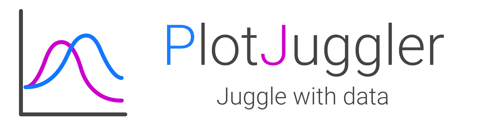
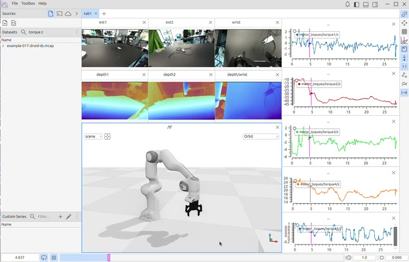

PlotJuggler 4 is an extensible, performant and open-source multi-modal visualization platform.

Explore recorded or live data, compare test runs, and analyze and transform your data,
in a single application.

<!-- Original screenshots: https://plotjuggler.io/videos/pj-scene3D-800.jpg,
     https://plotjuggler.io/videos/pj-plotting-800.jpg,
     https://plotjuggler.io/videos/pj-waymo-800.jpg. -->



## Analyze signals interactively

- **Drag and drop your data.** Drag signals into time-series and XY plots, zoom into events, and inspect individual samples.
- **Validate changes across runs.** Load several recordings, align their timelines, and overlay signals to compare behavior.
- **Analyze the signal.** Filter noise, measure rates of change, integrate values, or inspect frequency content with Fast Fourier Transforms.
- **Add your own functions.** Create derived series with custom transforms in Lua and Python, alongside the built-in filters.
- **Reuse your analysis.** Arrange plots in tabs and dockable panels, then save your layout and transforms for the next investigation.

## Multimodal data, synchronized in time

Efficient data storage, GPU-accelerated rendering and on-demand media decoding
help keep large recordings responsive as you explore.

<table>
  <tr>
    <td valign="top">
      <h3>Images and Videos</h3>
      <ul>
        <li>Raw and encoded images</li>
        <li>H.264, H.265 or AV1 video</li>
        <li>Live video streaming through WebRTC</li>
        <li>2D annotations and markers</li>
      </ul>
    </td>
    <td valign="top">
      <h3>3D rendering</h3>
      <ul>
        <li>Pointcloud, including compressed</li>
        <li>Meshes and URDF robot models</li>
        <li>Occupancy grids and maps (2D)</li>
        <li>Elevation grid maps (2.5D)</li>
        <li>3D annotations, trajectories and markers</li>
      </ul>
    </td>
  </tr>
</table>

## Work with the data you already have

Open supported formats directly and connect to your existing sensor and messaging
systems. Install ready-to-use loaders, streamers and tools through
**File → Marketplace**:

| Sources | Formats |
| --- | --- |
| **Files** | CSV, MCAP, Parquet, PX4 ULog, LeRobot, MP4, PCD and PLY |
| **Live streams** | ROS 2, MQTT, ZeroMQ, UDP, WebSocket bridges, WebRTC and Lab Streaming Layer |
| **Message encodings** | ROS 1/2, Protobuf, JSON, CBOR, BSON, Apache Arrow and MessagePack |
| **Cloud storage** | [Mosaico](https://mosaico.dev/) |

Need a custom integration? Build a loader, streamer, parser or toolbox with the
[plugin SDK](https://github.com/PlotJuggler/plotjuggler_sdk), or start from the
[official plugins](https://github.com/PlotJuggler/pj-official-plugins).

## How to get started

Every build is attached to the
[latest release](https://github.com/PlotJuggler/PlotJuggler/releases/latest).
Pick the one that fits your system.

### Windows

Download `PlotJuggler-<version>-Windows-x64.exe` from the
[latest release](https://github.com/PlotJuggler/PlotJuggler/releases/latest)
and run it. It installs for the current user, so no administrator rights are
needed.

### Debian and Ubuntu (apt repository)

Recommended on Ubuntu 22.04+ and Debian 12+: add the apt repository once, and
future releases arrive with `sudo apt upgrade`.

```bash
curl -fsSL https://apt.plotjuggler.io/pj4_install.sh | sudo sh
```

<details>
<summary>Prefer to run the steps yourself?</summary>

The script ([`packaging/deb/pj4_install.sh`](packaging/deb/pj4_install.sh)) does exactly this:

```bash
sudo install -d -m 0755 /etc/apt/keyrings
sudo curl -fsSL https://apt.plotjuggler.io/plotjuggler-archive-keyring.asc \
  -o /etc/apt/keyrings/plotjuggler.asc
echo "deb [arch=amd64 signed-by=/etc/apt/keyrings/plotjuggler.asc] https://apt.plotjuggler.io stable main" \
  | sudo tee /etc/apt/sources.list.d/plotjuggler.list
sudo apt update && sudo apt install plotjuggler4
```

</details>

To install a single release without adding the repository, download
`plotjuggler4_<version>_amd64.deb` from the
[latest release](https://github.com/PlotJuggler/PlotJuggler/releases/latest)
and run `sudo apt install ./plotjuggler4_<version>_amd64.deb`. A package
installed this way is not updated by `apt upgrade`.

### Any Linux distribution (AppImage)

Download `PlotJuggler-<version>-x86_64.AppImage` from the
[latest release](https://github.com/PlotJuggler/PlotJuggler/releases/latest),
then make it executable and run it:

```bash
chmod +x PlotJuggler-*-x86_64.AppImage
./PlotJuggler-*-x86_64.AppImage
```

It needs glibc 2.35 or newer (Ubuntu 22.04 and later, or equivalent).

### Building from source

For compilation and development setup, see [Building from source](docs/BUILDING.md).

## License

Released under the [Mozilla Public License 2.0](LICENSE).
Third-party dependencies retain their own licenses.
